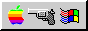

<!-- "Hero" Header -->

  
   
   
  
   
   

<!-- Social -->
<table width="100%" align="center">
<tr>
<td align="center">
<a href="http://luisschleef.github.io/"> 
<strong>Visita mi web personal </strong>
 
 
 

</a>

</td>

<td align="center" style="pointer-events: none; user-select: none;">
<strong>Se vienen cositas </strong>
 
 
 

</td>

<td align="center">
<a href="https://www.youtube.com/watch?v=oHg5SJYRHA0">
<strong>Escucha música cool</strong>
 
 
 

 
</a>

</td>
</tr>
</table>

<!-- Footer -->

 

&nbsp;&nbsp;&nbsp;&nbsp;  

&nbsp;&nbsp;&nbsp;&nbsp;  

